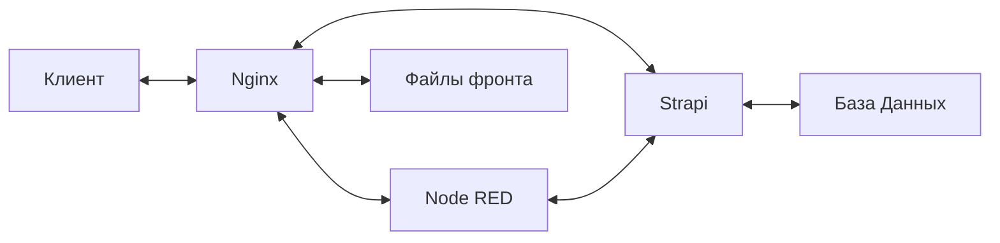

# Strife Fox Engine

> Backend и Frontend движок Strife Fox

## Запуск

> [!CAUTION]
> Запуск через `make dev` не предназначен для продуктового окружения и вызовет большие проблемы с безопасностью, т.к. открывает множество портов внутренних сервисов!

- Выполните `make dev` чтобы поднять среду разработки
- Перейдите на http://127.0.0.1:8080 чтобы открыть основную страницу сайта
- Выполняйте запросы по адресу http://127.0.0.1:8080/api/* чтобы обращаться к API NodeRED

- NodeRED UI: http://localhost:1880
- Strapi UI: http://localhost:1337
  - Login: `admin@strifefox.pro`
  - Pass: `StrifeFox0`

## Архитектура



## Полезные команды

### Запустить контейнер в режиме командной строки

```bash
docker run --rm -it --entrypoint sh nodered/node-red
```
