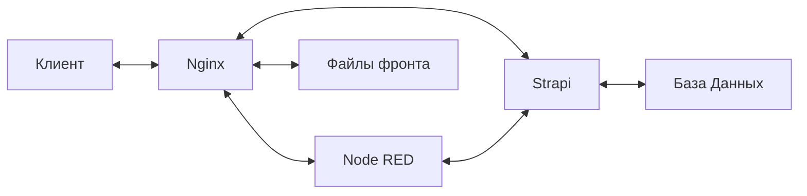

# Strife Fox Engine

> Backend и Frontend движок Strife Fox

## Запуск

- Выполните `make dev` чтобы поднять среду разработки
- Перейдите на http://127.0.0.1:8080 чтобы открыть основную страницу сайта
- Перейдите на http://127.0.0.1:8080/admin/nodered/ui чтобы открыть управление Gateway
- Выполняйте запросы по адресу http://127.0.0.1:8080/api/* чтобы обращаться к API

Strapi: http://localhost:1337/admin
admin@strifefox.pro
StrifeFox0

## Архитектура



## Полезные команды

### Запустить контейнер в режиме командной строки

```bash
docker run --rm -it --entrypoint sh nodered/node-red
```
